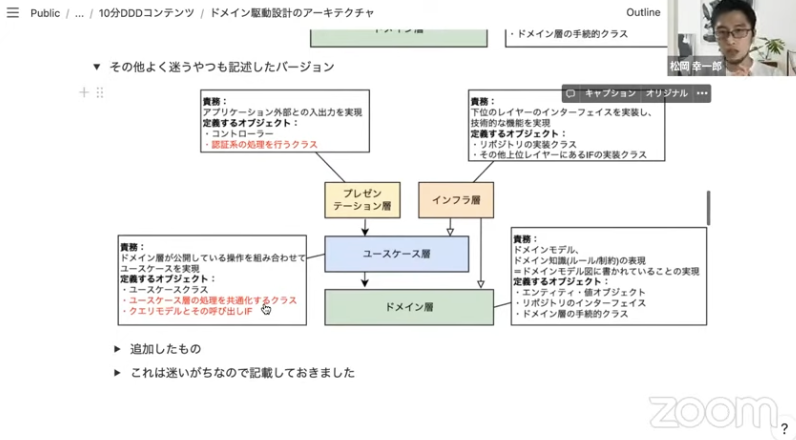
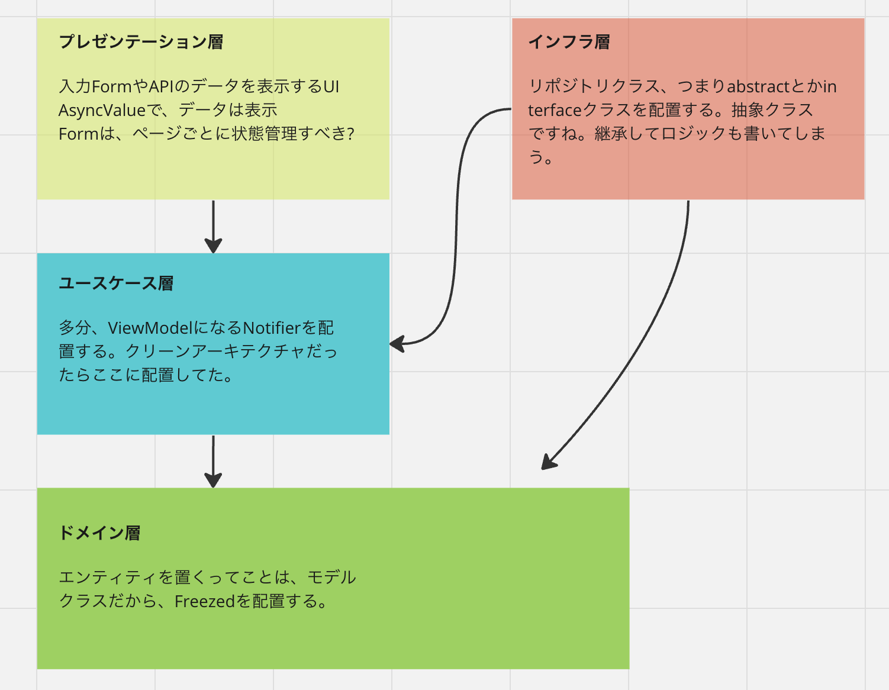

# オニオン・アーキテクチャとは?

オニオンアーキテクチャは、ソフトウェアアーキテクチャの一種で、アプリケーションを複数のレイヤーに分割することで、各レイヤーの依存関係を制御し、コードの再利用性とテストの容易性を向上させることを目指しています。

Flutterでのオニオンアーキテクチャは以下のようになります：

1. ドメイン層（中心）：これはアプリケーションのビジネスロジックを含む層で、エンティティとビジネスルールが存在します。この層は他のどの層にも依存しません。

```dart
/// Flutterならモデルクラスを配置する
import 'package:freezed_annotation/freezed_annotation.dart';
import 'package:flutter/foundation.dart';

part 'main.freezed.dart';
part 'main.g.dart';

@freezed
class モデル名 with _$モデル名 {
  const factory モデル名({
    required データ型 プロパティ名,
  }) = _モデル名;

  factory モデル名.fromJson(Map<String, Object?> json)
      => _$モデル名FromJson(json);
}
```

2. アプリケーション層：この層はドメイン層を使用して、ユースケースを実装します。この層はドメイン層に依存します。

```dart
/// FlutterだったらViewModelのNotifierを配置する
import 'package:microcms_api/core/logger.dart';
import 'package:microcms_api/model/blog_state.dart';
import 'package:microcms_api/repository/microcms_api.dart';
import 'package:riverpod_annotation/riverpod_annotation.dart';
part 'microcms_notifier.g.dart';

// ViewとModelの橋渡しをするViewModel
@riverpod
class MicroCmsNotifier extends _$MicroCmsNotifier {
  @override
  FutureOr<List<ResponseModel>> build() {
    return getCategories();
  }

  Future<List<ResponseModel>> getCategories() async {
    try {
      logger.d('AsyncNotifierを実行👻');
      return ref.read(microCmsApiProvider).getCategories();
    } catch (e) {
      logger.d('すべてのエラー: $e');
      throw Exception(e);
    }
  }
}
```

3. インフラストラクチャ層：この層はアプリケーションの永続性の詳細（データベース操作など）やネットワーク通信などを担当します。この層はアプリケーション層に依存します。

```dart
import 'dart:convert';
import 'package:http/http.dart' as http;
import 'package:flutter_dotenv/flutter_dotenv.dart';
import 'package:onion_architecture/domain/blog_state.dart';
import 'package:onion_architecture/core/logger.dart';
import 'package:riverpod_annotation/riverpod_annotation.dart';
part 'micro_cms_api.g.dart';
/*
status codeによってエラーを返すEnum。
今回は、HTTP GETだけなので、200かそれ以外かの2つだけ。
*/
enum MicroCMSApiStatus {
  success,
  serverError,
  networkError,
}
// ロジックを書いてないインターフェースを作って祖結合にしてみた。
abstract interface class MicroCMS {
  Future<List<ResponseModel>> getCategories();
}
// Riverpod1系だと、Providerを使う。
// final microCMSApiImplProvider = Provider<MicroCMSApiImpl>((ref) {
//   return MicroCMSApiImpl();
// });

// 状態が破棄されないように、keepAliveをtrueにしている。
@Riverpod(keepAlive: true)
MicroCMSApiImpl microCMSApiImpl(MicroCMSApiImplRef ref) {
  return MicroCMSApiImpl();
}

// MicroCMSApiImplクラスは、MicroCMSインターフェースを実装している。
class MicroCMSApiImpl implements MicroCMS {
  final baseUrl = 'https://xityyp5xvg.microcms.io/api/v1/blogs';

  @override
  Future<List<ResponseModel>> getCategories() async {
    try {
      final response = await http.get(
        Uri.parse(baseUrl),
        headers: {// .envファイルからAPIキーを取得
          'X-MICROCMS-API-KEY': dotenv.env['MICROCMS_API_KEY'] ?? '',
        },
      );
      // Enumを使って、ステータスコードによってエラーを返す。
      switch (response.statusCode) {
        case 200:// 200の場合は、成功なので、データを返す。
          final data = jsonDecode(response.body) as Map<String, dynamic>;
          if (data.containsKey('contents') && data['contents'] is List) {
            final contents = data['contents'] as List;
            logger.d('API Response👻: $contents');
            return contents
                .map((content) => ResponseModel.fromJson(content))
                .toList();
          } else {
            throw Exception('contents field is missing or null in data');
          }
        case 500:// 500の場合は、サーバーエラーなので、エラーを返す。
          throw MicroCMSApiStatus.serverError;
        default:// それ以外の場合は、ネットワークエラーなので、エラーを返す。
          throw MicroCMSApiStatus.networkError;
      }
    } catch (e) {
      // 例外が発生した場合は、Exceptionなので、エラーを返す。
      if (e is MicroCMSApiStatus) {
        throw Exception(e);
      } else {
        // network errorの場合は、enumのnetworkErrorを返す。
        throw MicroCMSApiStatus.networkError;
      }
    }
  }
}
```

4. プレゼンテーション層：これはユーザーインターフェース（UI）を含む層で、ユーザーとの対話を管理します。この層はアプリケーション層に依存します。

このアーキテクチャの主な利点は、各層が独立しているため、変更やテストが容易であること、そして各層が特定の責任を持っているため、コードが整理されやすいことです。

```dart
import 'package:flutter/material.dart';
import 'package:flutter_dotenv/flutter_dotenv.dart';
import 'package:flutter_riverpod/flutter_riverpod.dart';
import 'package:onion_architecture/application/micro_cms_state.dart';
import 'package:onion_architecture/presentation/detail_page.dart';

// MicroCMSのデータを表示するページ
class BlogPage extends ConsumerWidget {
  const BlogPage({Key? key}) : super(key: key);

  @override
  Widget build(BuildContext context, WidgetRef ref) {
    // APIからのデータは、`AsyncValue`のデータ型で渡されてくる
    final microCms = ref.watch(microCmsStateProvider);
    return Scaffold(
      appBar: AppBar(
        title: Text(dotenv.env['HI'] ?? ''),// .envからテキストを取得
      ),
      body: microCms.when(
        data: (cms) {
          return Padding(
            padding: const EdgeInsets.only(top: 12.0),
            child: ListView.builder(
              itemCount: cms.length,
              itemBuilder: (context, index) {
                final title = cms[index].title;
                return ListTile(
                  // Listをタップしたら、詳細ページに遷移する
                  onTap: () {
                    Navigator.of(context).push(
                      MaterialPageRoute(
                        builder: (context) =>
                            DetailPage(responseModel: cms[index]),
                      ),
                    );
                  },
                  // アバター画像を表示
                  leading: cms[index].eyecatch != null
                      ? Padding(
                          padding: const EdgeInsets.only(top: 4.0, bottom: 4.0),
                          child: SizedBox(
                              width: 100,
                              height: 100,
                              child: Image.network(cms[index].eyecatch!.url)),
                        )
                      : null,
                  title: Text(title!),// ブログのタイトルを表示
                );
              },
            ),
          );
        },
        loading: () => const Center(child: CircularProgressIndicator()),
        error: (err, stack) => Center(child: Text('Error: $err')),
      ),
    );
  }
}
```

coreについてですが、ここには、`logger`とかコンバーターのコードを置くそうです。

```dart
import 'package:logger/logger.dart';
/// [print文は使わずに、logger.d('')などでログを出力する]
final logger = Logger(
  printer: PrettyPrinter(
      methodCount: 2, // 表示するメソッド呼び出し数
      errorMethodCount: 8, // スタックトレースが提供される場合のメソッド呼び出し数
      lineLength: 120, // 出力の幅
      colors: true, // カラフルなログメッセージ
      printEmojis: true, // ログメッセージに絵文字を表示する
      printTime: false // 各ログ出力にタイムスタンプを含める
  ),
);
```

📁このアプリのディレクトリ構成:
```
lib
├── application
│   ├── README.md
│   ├── micro_cms_notifier.dart
│   ├── micro_cms_state.dart
│   ├── micro_cms_state.g.dart
│   └── usecase
├── core
│   └── logger.dart
├── domain
│   ├── README.md
│   ├── blog_state.dart
│   ├── blog_state.freezed.dart
│   └── blog_state.g.dart
├── infrastructure
│   ├── README.md
│   ├── micro_cms_api.dart
│   └── micro_cms_api.g.dart
├── main.dart
└── presentation
    ├── blog_page.dart
    └── detail_page.dart
```

参考になる動画のスクリーンショット:



Riverpod + Freezedに合わせて設計してみた図:


